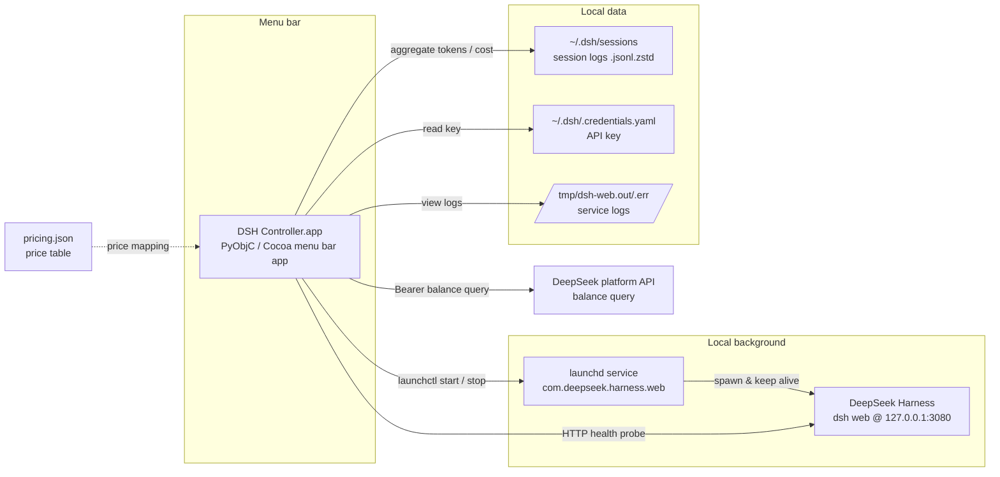

# DeepSeek Harness Controller

[](LICENSE)
[]()
[](https://github.com/deepseek-ai/deepseek-harness)

[简体中文](README.zh.md)

A macOS menu bar controller for [DeepSeek Harness](https://github.com/deepseek-ai/deepseek-harness) (DSH): a little fish lives in your menu bar — click it to start/stop the DSH service, check its health, and view local usage stats and account balance without keeping the web console open.

> ⚠️ Prerequisite: this is a **companion remote for DSH**. It requires DeepSeek Harness installed (or installable) on your Mac. Without DSH there is nothing to control.

## Features

- 🐟 Menu bar icon with status dot and remaining balance at a glance
- ▶️ One-click start / stop / restart of the DSH service (launchd-based; the service survives Controller restarts)
- 📊 Local usage stats: 7-day token & cost charts, cache hit rate, API request counts, per-model breakdown
- 💰 Account balance and today's spend (official API; key read from `~/.dsh/.credentials.yaml`)
- 🌗 Follows system light/dark mode automatically

## Architecture



The Controller only controls and displays: all usage data comes from DSH's local session logs (`~/.dsh/sessions`), nothing is uploaded; the only outbound request is the official balance API with your own key.

## Install

Requires macOS 13+, Python 3.9+ (system Python is fine); Homebrew recommended.

```bash
git clone https://github.com/GDK0722/deepseek-harness-controller.git
cd deepseek-harness-controller
./install.sh
```

The script creates a local `.venv` with PyObjC, assembles `DSH Controller.app`, detects how your DSH is installed (npm global / pnpm / Homebrew / nvm / source checkout via `DSH_SOURCE_DIR`) and registers a launchd service, and optionally sets up launch-at-login. No sudo, no shell config changes.

> Note: the venv path is baked into the app launcher — **do not move the repo directory after installing**.

Then double-click `DSH Controller.app` in the repo (or log in again if you enabled auto-start). The fish in the menu bar means success.

### Let an agent install it for you

Hand [INSTALL-FOR-AGENTS.md](INSTALL-FOR-AGENTS.md) to your AI agent (Claude Code / Kimi / Codex …) and let it follow the instructions.

## Configuration

| Scenario | How |
|---|---|
| DSH on a non-default port (`dsh web --port 8080`) | Create `~/.dsh/controller.json` with `{"port": 8080}`, restart the Controller |
| DeepSeek changes pricing | Edit `src/pricing.json` (or the copy inside the app bundle), restart the Controller |
| No launch-at-login | Install with `--no-login-item` |

## Uninstall

```bash
./uninstall.sh
```

Removes only what the installer created (two LaunchAgent plists, `.venv`, the `.app`). DSH itself and `~/.dsh` data are untouched.

## License

MIT © DK · Coded by Kimi and DK
