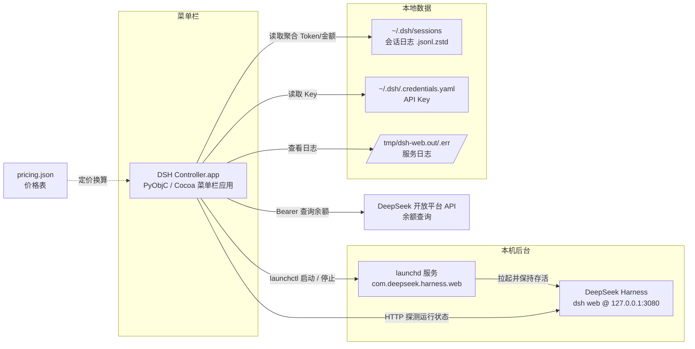

# DeepSeek Harness Controller

[](LICENSE)
[]()
[](https://github.com/deepseek-ai/deepseek-harness)

[English](README.md)

[DeepSeek Harness](https://github.com/deepseek-ai/deepseek-harness)（DSH）的 macOS 菜单栏控制器：一条小鱼住在菜单栏上，点开就能启停 DSH 服务、查看运行状态、本地用量统计与账户余额，不用再开着开放平台网页。

> ⚠️ 前置条件：本工具是 **DSH 的配套遥控器**，需要你的 Mac 上已经安装（或愿意安装）DeepSeek Harness。没有 DSH 的话，它没有控制对象。

## 为什么做这个

用 DSH 的人都知道，它是个网页。每次要用，得先把进程跑起来，再打开浏览器输地址。步骤不多，但天天来这么一遍就有点烦。

所以我就写了这个东西。点一下菜单栏的小鱼，进程就起来了；再点一下，面板弹出来，服务正不正常、余额还剩多少、Token 烧了多少、flash 和 pro 各花了多少，全在上面。网页那套就不用开了。

先说好，我是个小白，不是专业开发者。DSH 给我的感觉有点像以前的 Jupyter Notebook，挺好玩的，就是每次开始之前都得先倒腾一下。这个工具就是帮我把"倒腾"那步省了。对我有用，对你不一定有用，不喜勿喷 🙂

## 功能

- 🐟 菜单栏图标 + 状态圆点 + 剩余总金额，一眼掌握服务与账户状态
- ▶️ 一键启动 / 停止 / 重启 DSH 服务（基于 launchd，Controller 退出服务照常运行）
- 📊 本地用量统计：近 7 日 Token 消耗与金额、缓存命中率、API 请求数、分模型占比
- 💰 账户余额与本日消耗（通过官方 API，Key 从 `~/.dsh/.credentials.yaml` 读取）
- 🌗 自动跟随系统深浅色模式

## 架构



Controller 只做"控制与展示"：所有用量数据都来自 DSH 本地会话日志，不上传任何东西；唯一的外网请求是用你的 API Key 查官方余额接口。

## 安装

要求：macOS 13+，Python 3.9+（系统自带即可），建议装有 Homebrew。

```bash
git clone https://github.com/GDK0722/deepseek-harness-controller.git
cd deepseek-harness-controller
./install.sh
```

脚本会自动：创建本目录内的 `.venv` 并安装 PyObjC → 组装 `DSH Controller.app` → 探测你的 DSH 安装方式（npm 全局 / pnpm / Homebrew / nvm / 源码版）并注册 launchd 服务 →（可选）配置开机自启。全程不需要 sudo，不会修改 shell 配置。

> 注意：venv 路径写死在 App 启动器里，**安装后不要移动仓库目录**。

装完后双击仓库里的 `DSH Controller.app`（或重启后自动启动），菜单栏出现小鱼即成功。

### 让 Agent 帮你装

把仓库里的 [INSTALL-FOR-AGENTS.md](INSTALL-FOR-AGENTS.md) 链接直接丢给你的 AI Agent（Claude Code / Kimi / Codex 等），让它照着做即可。

## 配置

| 场景 | 做法 |
|---|---|
| DSH 用了非默认端口（`dsh web --port 8080`） | 创建 `~/.dsh/controller.json`，写入 `{"port": 8080}`，重启 Controller |
| DeepSeek 官方改价 | 编辑仓库 `src/pricing.json`（或直接改 App 内 `Contents/Resources/pricing.json`），重启 Controller |
| 不想开机自启 | 安装时加 `--no-login-item`，或运行 `./uninstall.sh` 后重装 |

## 卸载

```bash
./uninstall.sh
```

只移除本安装器创建的内容（两个 LaunchAgent plist、`.venv`、`.app`），不动 DSH 本体和 `~/.dsh` 数据。

## 常见问题

**双击 App 会被 Gatekeeper 拦吗？**
不会。App 是在你本机现场构建的，不属于"从网上下载的程序"，不触发安全拦截。

**DSH 还在开发者预览期，会有破坏性变更吗？**
官方 README 明示会有。本工具已适配 2026-08 时的版本（默认端口 3080、`~/.dsh/sessions` 日志格式）；若 DSH 升级后异常，欢迎提 issue。

**为什么用量统计页没有数据？**
多半是缺 `zstd`（解压会话日志用）：`brew install zstd` 后重启 Controller 即可。

## 许可证

MIT © DK · Coded by Kimi and DK
